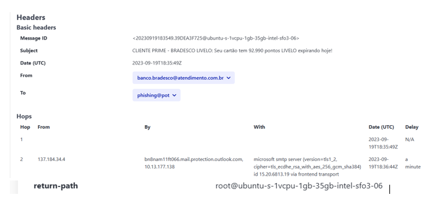
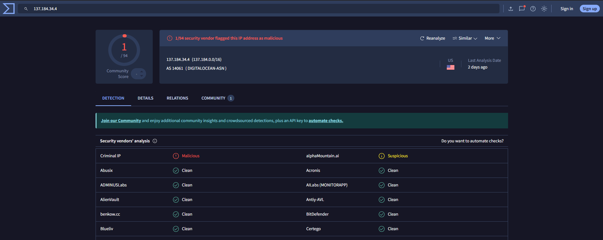
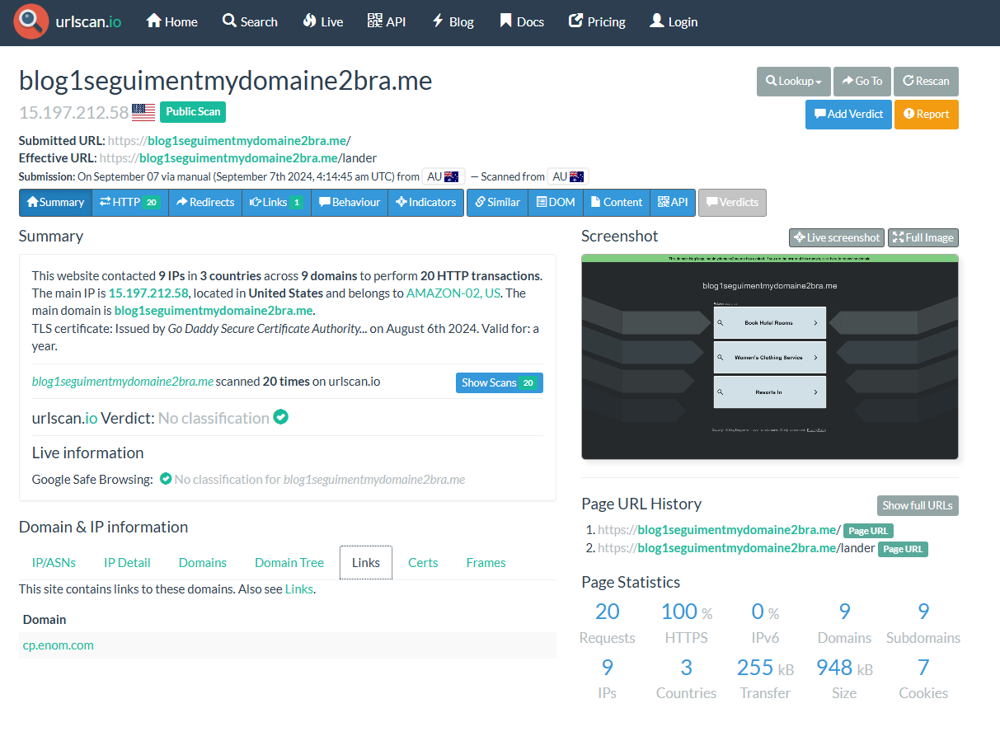
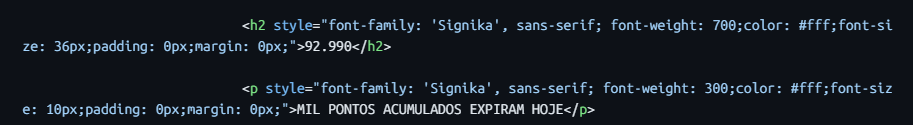

<link rel="stylesheet" href="./assets/style.css">

# 🛡️ SOC Challenge: Day #22 – Phishing Email Analysis

Welcome to my phishing email analysis lab for **Day #22** of the SOC Challenge.

## 🔍 Investigation Highlights

- **Sender:** banco.bradesco@atendimento.com.br
- **Domain:** atendimento.com.br
- **IP Address:** 137.184.34.4
- **SPF Result:** Temperror
- **Suspicious URL:** [blog1seguimentmydomaine2bra.me](https://blog1seguimentmydomaine2bra.me)

## 📸 Screenshots

| Evidence | Description |
|---------|-------------|
|  | Header showing From, Return-Path, IP |
|   | IP reputation scan |
| | Phishing URL scan |
|  | HTML email content spoofing |

## 📁 Download Report

[📄 View full report (report.md)](./report.md)

---

_This lab was created as part of my cybersecurity training and GitHub portfolio._

 